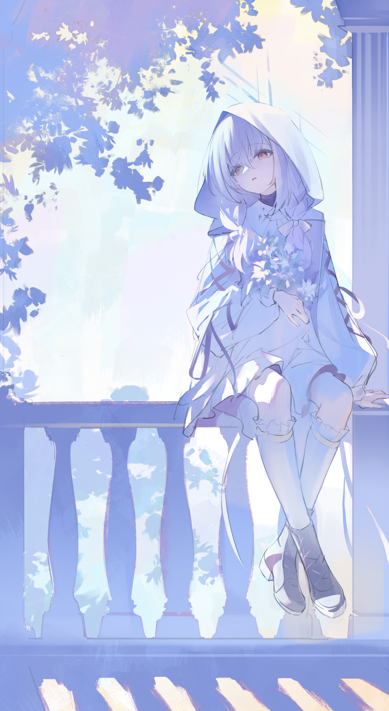
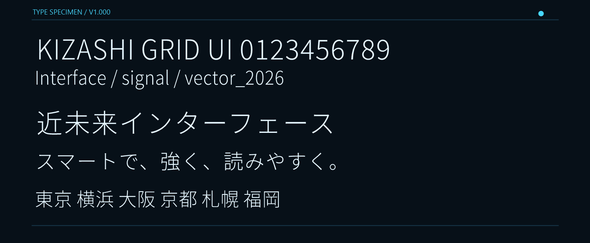

# Atyan's Revenge Add-ons

Discord Revenge向けに作成したテーマとフォントをまとめています。

## テーマ

### Hare Camp!

黒の半透明パネル、白い文字、黄色のアクセントを使用したテーマです。


Revengeのテーマ追加画面へ、次のURLを貼り付けてください。

```text
https://raw.githubusercontent.com/atyan-desu/liquid-lemon-glass-revenge/main/liquid-lemon-glass.revenge.json
```

### Atuko coo!

白・薄紫・濃い紫を使用し、添付イラストを見やすく表示するテーマです。



Revengeのテーマ追加画面へ、次のURLを貼り付けてください。

```text
https://raw.githubusercontent.com/atyan-desu/liquid-lemon-glass-revenge/main/lavender-veil.revenge.json
```

## フォント

### Kizashi Smart UI

日本語表示に対応した、細身で読みやすいUIフォントです。



Revengeのフォント追加画面へ、次のURLを貼り付けてください。

```text
https://raw.githubusercontent.com/atyan-desu/liquid-lemon-glass-revenge/main/kizashi-smart-ui.revenge-font.json
```

フォントは [SIL Open Font License 1.1](KizashiSmartUI-OFL.txt) に従って公開しています。

## 適用方法

1. Discordの設定からRevengeを開きます。
2. テーマまたはフォントの追加画面を開きます。
3. 使用したい項目のURLを貼り付けます。
4. 追加したテーマまたはフォントを選択します。
5. Discordを再起動します。

## 作者

Atyan